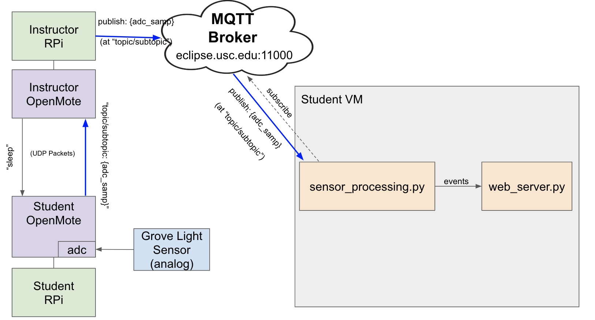

# Raspberry Pi Light Sensor IoT System

A home IoT system with easily deployable, battery-powered sensor nodes that will detect the intensity of light in each room of the house in order to determine when the lights have been turned on and off throughout the day. 

## Prerequisites
Hardware:
```
Raspberry Pi
Openmote
ADC light sensor for RPI
```
Software:
```
RIOT
Flask
MQTT
```
## Diagram

